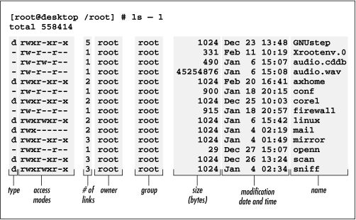
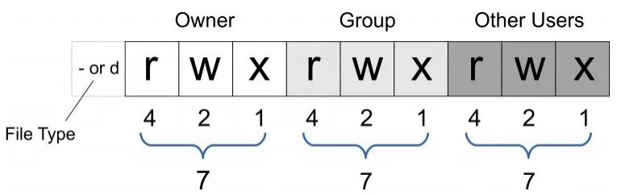
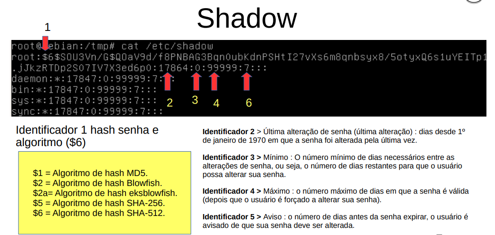

# Tecnologias Hacker - Resumo

Roteiros e Resumo da disciplina Tecnologias Hacker

## Wireshark

Observação de pacotes (importando arquivos pcap).Os arquivos pcap podem ser adquiridos usando o TCP dump

**TCP Dump:** É uma ferramenta utilizada para monitorar os pacotes trafegados numa rede de computadores. Ela mostra os cabeçalhos dos pacotes que passam pela interface de rede.

Argumetos:

- -i: Seleciona a interface
- -v: Saída detalhada
- -vv: Saída Extremamente Detalhada
- -w: Saída para algum arquivo
- -r: acessar saída gerada

```console
tcpdump -i eth0 -w resultadodacaptura.pcap
```

```console
tcpdump -r resultadodacaptura.pcap
```

## Coletar informações do Alvo

- Encontrar ip de boradcast

```console
ifconfig
```

- Comunicar com todos que estão na mesma rede

```console
ping {ip_broadcast}
```

- Descobrir todos os IPs que estão na mesma rede

```console
arp-scan -l
```

- Descobrir qual serviço está rodando no alvo em alguma porta específica

```console
netcat -z -n -v {ip} {port}
```

```console
nmap {ip} -p{port}
```

- Descobrir quais serviços estão rodando nas portas do computador

Utilizando o script, é possível verificar um ip específico, ou passar um intervalo de ip para realizar a análise. O mesmo raciocínio é feito para as portas.

```console
python3 portScanner.py -ip{ip1, ip2} -p{port1,port2}
```

Utilizando o Nmap

```console
nmap {ip}
```

- Obter informações do sistema operacional

```console
telnet {ip} 22
```

```console
nmap -O {ip}
```

## Listar Vulnerabilidades do alvo

- Vulnerabilidades (CVE - Common Vulnerabilities and Exposures)

```console
nmap -sV --script vuln {ip} -p{port1},{port2}
```

- Encontrar um **exploit** (maneira de explorar as vulnerabilidades)

```console
nmap -sV --script malware {ip} -p{port1},{port2}
```

## Encontrar Informações de um domínio

- Obter endereço de IP associado

```console
nslookup {dominio}
```

```console
dig {dominio}
```

- Servidor DNS

```console
host -t ns {dominio}
```

- Servidor de Email associado

https://dnschecker.org/mx-lookup.php

- Obter outros domínios no mesmo IP

https://hackertarget.com/reverse-ip-lookup/

- Sistema operacional do servidor

```console
ping {dominio}
```

A partir desse comando, com o resultado do TTL, é possível inferir o sistema opeacional, usando a tabela desse [link](https://www.yeahhub.com/identify-operating-system-using-ping-command/)

- Tecnologias Utilizadas no site:

Utilizar extesão **Wappalyzer**

- Identificação de WAF (Web Application Firewall)

```console
wafw00f -a -v {dominio}
```

## Processos e permissões

- **Processos:**

Em sistemas operacionais Unix, existe sistema de processos pais e filhos, em que o processo pais de todos é o `systemd`.

Listando processos

```console
pstree
```

Lista processos ativos

```console
ps
```

Lista processos em forma dinâmica

```console
top
```

Finalizar processos

```console
kill -9 {process_id}
```

- **Permissões**

Obter tipos de permição dos arquivos:

```console
ls -l
```



Alterar permissões



```console
chmod {permission} {filename}
```

Na permissão, são colocados uma sequência de 3 números que fazem referências as permissões de Owner, Group e Other Users, respectiviamente. Esses números são calculados pela das permissões, em que:

4 - Permissão de leitura (r)
2 - Permissão de escrita (w)
1 - Permissão de execução (x)

Assim, a permissão **777** concede leitura, escrita e execução para todos os grupos.

## Controle de Acesso e Firewall

texto

## Quebra de Senhas

- **Ofline:** Por meio de uma cópia das hashes de senha tentar revertê-las para seu formato texto claro.

- **Online:** Com uso de scans automatizados e scripts para tentar fazer login automaticamente em serviços para descobrir credenciais válidas.

##### Armazenameento de senhas de SO

- Windows
  Security Accounts Manager (SAM)

  - c:\windows\system32\config\SAM → armazena hashes de senha do Windows. Este banco de dados é protegido pelo Utilitário Windows Syskey, que criptografa as hashes das senhas no arquivo SAM com o RC4 de 128 bits, provendo uma segurança adicional

  - c:\windows\system32\config\SYSTEM → armazena as chaves de criptografia para reverter as hashes criptografadas.

Por meio do **Samdump2** é possível recuperar senhas

```console
samdump2 -o {output_filename.txt} SYSTEM SAM
```

Com o output de senhas gerado, é possível decifrar a senha no site https://hashes.com/en/decrypt/hash. Para isso, é necessário copiar e colocar a senha do output gerado no site. A hash está localizada após os `:` e antes dos `:::` finais, como no exemplo abaixo:

web1:1001:aad3b435b51404eeaad3b435b51404ee:**59edfb15aec624e7ccf5c8c50682c649**:::

- Linux
  /etc/passwd → armazena os UID e nome de users
  /etc/shadow → armazena os hashes das senhas



##### Geração de Wordlists

- Cewl

```console
cewl -w {wordlist_output.txt} -d {quantidade_links} -m {tamanho_minimo_senha} {ip_alvo}
```

- Crunch

```console
crunch {minimo_caracteres} {maximo_caracteres} qwerty > palavra.txt
```

- [Cupp](https://github.com/Mebus/cupp): questionários com informações pessoais do alvo para gerar a wordlist

```console
python3 cupp.py -i
```

##### Descobrindo user e pass com hydra

- Tendo posse do nome de usuário:

```console
hydra -l {username} -P {wordlist.txt} {ip_alvo} {protocolo}
```

- Não Tendo posse do nome de usuário (passar uma lista com possíveis nomes de usuários):

```console
hydra -L {listausuarios.txt} -P {wordlist.txt} {ip_alvo} {protocolo}
```

`Protocolos Comuns: ssh, ftp`

## Comandos importantes

- **Arp spoofing:** Este ataque consiste em adicionar ou substituir na tabela arp da `maquina alvo` uma entrada que aponte um IP do Alvo para o MAC Address do Atacante na tabela ARP da vítima.

  É o método mais rápido de se estabelecer no meio da comunicação entre duas máquinas e interceptar as informações enviadas entre ambas

```console
arpspoof -i {INTERFACE_REDE} -t {IP_DO_ALVO} {IP_DO_GATEWAY}
```
